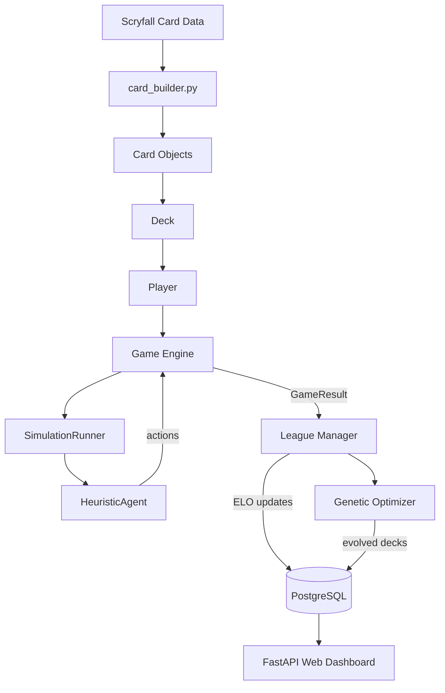

# Architecture Overview

MTG Deck Testing is a simulated Magic: The Gathering league that evolves decks through genetic algorithms, runs game simulations via a rules engine, and surfaces analytics through a web dashboard.

## Package Map

```text
├── engine/            Core game rules engine
│   ├── card.py           Card model (5,700 lines — keywords, effects, Oracle parsing)
│   ├── game.py           Game loop, phases, stack, priority, combat, SBAs
│   ├── player.py         Player state, mana pool, backtracking cost payment
│   ├── deck.py           Deck blueprint and game-deck generation
│   ├── zone.py           Generic card container (library, hand, graveyard, etc.)
│   ├── card_builder.py   Scryfall JSON → Card object conversion
│   ├── deck_builder_util.py  Shared build_deck() utility (DRY)
│   ├── bo3.py            Best-of-3 match runner with sideboarding
│   ├── rules_sandbox.py  Rule injection and game-state modification for testing
│   ├── format_validator.py  Deck legality checking per format
│   └── mechanics/        Keyword ability implementations
│
├── agents/            AI decision-making
│   ├── heuristic_agent.py   Priority-based agent (threat assessment, role detection)
│   ├── strategic_agent.py   MCTS-based look-ahead agent
│   ├── mulligan_ai.py       Neural network + heuristic opening hand evaluator
│   ├── sideboard_agent.py   Post-game sideboard decisions
│   └── base_agent.py        ABC for agent interface
│
├── simulation/        Simulation execution layer
│   ├── runner.py            Single-game simulation runner
│   ├── parallel.py          Multiprocessing match execution (Redis RQ)
│   └── stats.py             GameResult dataclass and statistics aggregation
│
├── league/            Evolutionary league management
│   ├── manager.py           Season lifecycle, matchmaking, ELO updates
│   ├── gauntlet.py          Boss deck benchmarks
│   └── historical_gauntlet.py  Historical era Time Machine
│
├── optimizer/         Genetic algorithm deck evolution
│   └── genetic.py          Mutation, crossover, fitness, elitism
│
├── web/               FastAPI web application
│   ├── app.py              Pure wiring (85 lines — mounts routes)
│   ├── cache.py            Module-level card pool cache
│   └── routes/
│       ├── views.py         HTML template rendering
│       ├── decks.py         Deck CRUD + card search API
│       ├── simulation.py    Deck testing, flex optimization, mana calc
│       ├── meta.py          Metagame analytics, trends, matchup matrix
│       └── admin.py         Admin portal and crash reports
│
├── data/              Database and card data
│   └── db.py              PostgreSQL connection pool + queries
│
└── tests/             pytest test suite (514+ tests)

## Data Flow



## Key Design Decisions

| Decision | Rationale |
| --- | --- |
| Backtracking mana solver | Handles hybrid mana `{R/W}` and dual lands correctly |
| Module-level card pool cache | Avoids re-parsing 30k cards per request |
| Lazy engine `__init__.py` | Import only what you use — 5.7k-line card.py not loaded unless needed |
| Shared `build_deck()` utility | DRY — single source of truth for dict→Deck conversion |
| Heuristic agent with role detection | "Who's the Beatdown?" determines aggro/control/midrange dynamically |
