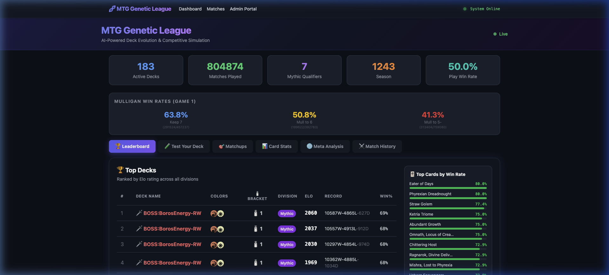
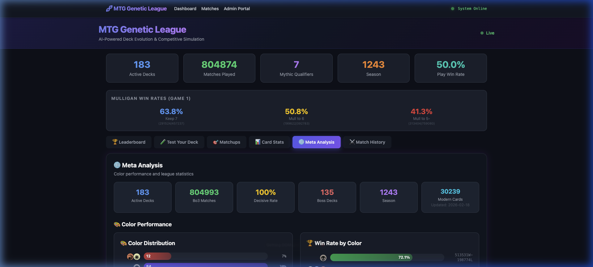
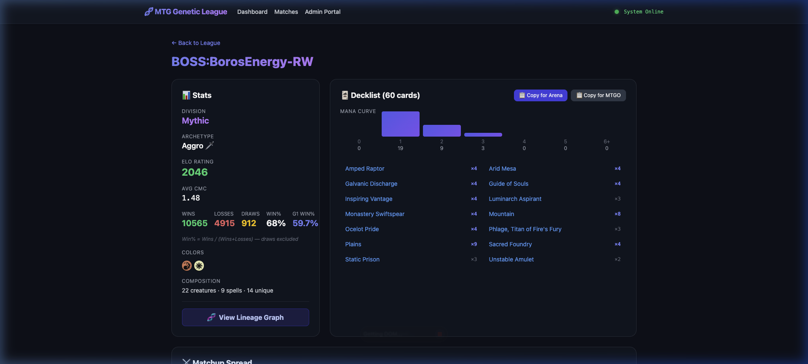
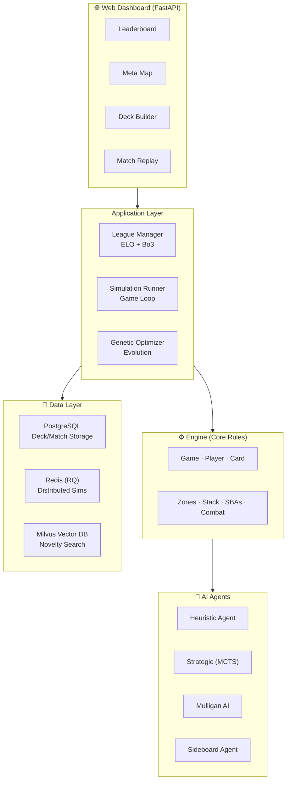
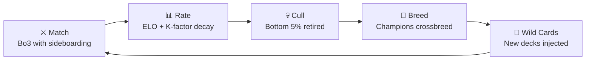

# MTG Genetic League 🧬⚔️

**AI-powered evolutionary deck building and competitive simulation for Magic: The Gathering.**

The MTG Genetic League evolves decks through natural selection — populations of decks play Best-of-Three matches, the strongest survive, breed, and mutate, while the weakest are retired. Over generations, decks converge toward competitively viable strategies that can match tournament-level archetypes.

---

## What It Does

| For MTG Players | For Engineers |
|---|---|
| Test your deck against evolved meta opponents | Full MTG rules engine with 269+ automated tests |
| View matchup spread, win rates, and metagame trends | Genetic algorithm with novelty-search fitness |
| Export decklists to Arena/MTGO format with sideboard | Distributed simulation via Redis + PostgreSQL |
| Analyze opening hands with Mulligan AI | Real-time ELO streaming via WebSocket |
| Explore deck lineage trees and evolution history | Comprehensive REST API (FastAPI) |

---

## Screenshots

| Dashboard & Leaderboard | Metagame Analytics |
|:-:|:-:|
|  |  |

| Deck Detail |
|:-:|
|  |

> **New here?** Check out the **[Getting Started Guide](docs/GETTING_STARTED.md)** for a walkthrough of every feature.

## Architecture



---

## Quick Start

### Local Development (SQLite fallback — no Docker needed)

```bash
# 1. Clone and install
git clone https://github.com/mstits/MTG-Genetic-League-Deck-Testing.git
cd MTG-Genetic-League-Deck-Testing
python -m venv .venv && source .venv/bin/activate
pip install -r requirements.txt

# 2. Fetch the card pool from Scryfall (~170 MB)
python scripts/fetch_cards.py

# 3. Seed initial decks from tournament data
python scripts/import_tournament.py

# 4. Run the league (evolves decks each season)
python run_league.py

# 5. Launch the dashboard
python -m uvicorn web.app:app --reload --port 8000
# Open http://localhost:8000
```

### Production (Docker Compose)

```bash
docker-compose up -d --build
# Dashboard: http://localhost:8000
# Admin:     http://localhost:8000/admin
```

---

## Project Structure

```
engine/              Core MTG rules engine
├── game.py          Game loop, phases, stack, combat, SBAs (2,700+ lines)
├── card.py          Card model with Oracle text parser (4,800+ lines)
├── player.py        Player state, mana payment (backtracking solver)
├── bo3.py           Best-of-Three match system with sideboarding
├── layers.py        Layer system for continuous effects (Rule 613)
├── format_validator.py  Deck legality checking
└── rules_sandbox.py     100+ automated rules interaction tests

agents/              AI decision engines
├── heuristic_agent.py   Priority-based agent with threat assessment
├── strategic_agent.py   MCTS + tempo/card-advantage hybrid
├── mulligan_ai.py       Transformer-based opening hand evaluator
└── sideboard_agent.py   Matchup-aware sideboard construction

optimizer/           Evolutionary deck construction
└── genetic.py       Selection, crossover, mutation, novelty search

league/              Competitive league management
├── manager.py       Season cycle: match → rate → cull → breed
├── gauntlet.py      Boss deck deployment from tournament data
└── historical_gauntlet.py  "Time Machine" era testing

simulation/          Game execution
├── runner.py        Runs single games with agent decisions
├── parallel.py      Redis-distributed match execution
└── flex_tester.py   Flex slot optimization (hypergeometric)

web/                 Dashboard and API
├── app.py           FastAPI routes (leaderboard, meta, export, replay)
├── match_parser.py  Game log → structured replay data
└── templates/       Jinja2 HTML templates

data/                Storage layer
└── db.py            PostgreSQL/SQLite dual-backend with auto-detection

tests/               269+ automated tests
├── test_engine.py   Core rules: lands, combat, stack, SBAs
├── test_tier2-7.py  Mechanics: auras, equipment, flashback, vehicles...
└── test_strategic_agent.py  AI integration tests
```

---

## Engine: What's Implemented

### MTG Rules Coverage

| Category | Implementation |
|----------|--------------|
| **Turn Structure** | Untap → Upkeep → Draw → Main 1 → Combat → Main 2 → End → Cleanup |
| **Mana System** | 5 colors + colorless + generic, backtracking payment solver, hybrid costs |
| **Stack** | LIFO resolution, dual-pass priority, instant-speed responses |
| **Combat** | Declare attackers/blockers, first strike, double strike, trample, menace |
| **Keywords** | Flying, deathtouch, lifelink, hexproof, indestructible, flash, haste, vigilance, reach, ward, flanking, prowess |
| **Mechanics** | ETB/LTB triggers, attack/damage triggers, upkeep effects, landfall, cycling, kicker, flashback, persist, undying, crew/vehicles |
| **Planeswalkers** | Loyalty counters, +/−/0 abilities, sorcery-speed activation, combat targeting, loyalty SBA |
| **Removal** | Destroy, exile, bounce, fight, −X/−X, board wipes, sacrifice |
| **Card Types** | Creatures, instants, sorceries, enchantments (including Auras), artifacts, equipment, planeswalkers, tokens |
| **State-Based Actions** | Creature death (toughness/damage/deathtouch), planeswalker loyalty, player life/poison/commander damage, legend rule, Aura attachment |
| **Layer System** | Rule 613 compliance: copy → type → color → abilities → P/T (base → counters → effects → switching) |

### AI Decision System

The heuristic agent uses a priority-based decision cascade:

1. **Board Wipes** — Clear when outnumbered ≥3 creatures
2. **Removal** — Unified threat scoring across all permanent types
3. **Creatures** — Curve-aware deployment with synergy bonuses
4. **Pump Spells** — Combat trick timing after blocks declared
5. **Card Draw** — Refuel when hand is low
6. **Land Drops** — Color-priority tapping, shock/fetch life decisions

Role detection (aggro/midrange/control) adjusts every decision contextually.

---

## REST API

| Endpoint | Method | Description |
|----------|--------|-------------|
| `/api/leaderboard` | GET | Ranked deck listings with ELO and division |
| `/api/top-cards` | GET | Cards with highest win rates |
| `/api/meta` | GET | Color, archetype, and synergy breakdown |
| `/api/matchup-matrix` | GET | Color vs color win-rate matrix |
| `/api/meta-trends` | GET | Historical archetype popularity + win rates by season |
| `/api/export/{deck_id}` | GET | Deck export (Arena/MTGO format) with sideboard |
| `/api/card-coverage` | GET | Card pool play rates across active decks |
| `/api/mulligan-eval` | POST | Evaluate opening hand with Mulligan AI |
| `/api/salt-score` | POST | Commander salt score and bracket |
| `/api/gauntlet/run` | POST | Test a decklist against historical era Top 8 |
| `/api/test-deck` | POST | Test a decklist against top league opponents |
| `/api/mutations/heatmap` | GET | Top card swaps ranked by ELO delta |
| `/api/hall-of-fame` | GET | All-time greatest evolved decks |
| `/api/engine/config` | GET/POST | Engine runtime configuration |
| `/api/butterfly-reports` | GET | Misplay Hunter upset analysis reports |
| `/deck/{id}` | GET | Deck detail page with stats and lineage |
| `/deck/{id}/lineage` | GET | Mermaid-based evolutionary tree visualization |
| `/match/{id}/replay` | GET | Interactive 2D match replay |
| `/ws/elo` | WS | Real-time ELO update stream |

---

## Testing

```bash
# Run all tests
python -m pytest tests/ -v

# Run specific tier
python -m pytest tests/test_tier4.py -v  # Planeswalker tests

# Run with coverage
python -m pytest tests/ --cov=engine --cov-report=term-missing
```

**Current: 269 passed, 0 failed, 1 skipped**

Test tiers:

- **Tier 1** (`test_engine.py`): Core rules — lands, combat, stack, removal
- **Tier 2** (`test_tier2.py`): Auras, equipment
- **Tier 3** (`test_tier3.py`): Flashback, scry, discard, search, pump spells
- **Tier 4** (`test_tier4.py`): Planeswalkers — loyalty, abilities, combat targeting
- **Tier 5** (`test_tier5.py`): Triggers — attack, combat damage, landfall, kicker, counterspells
- **Tier 6** (`test_tier6.py`): Cycling, fight, mill, proliferate
- **Tier 7** (`test_tier7.py`): Vehicles, prowess, bounce, sacrifice, treasure

---

## ELO System

Decks are rated using the [Elo rating system](https://en.wikipedia.org/wiki/Elo_rating_system) with **K-factor decay**:

| Games Played | K-Factor | Behavior |
|-------------|----------|----------|
| < 10 | 40 | Fast rating discovery for new decks |
| 10–30 | 24 | Moderate adjustments |
| 30+ | 12 | Stable rankings for veterans |

Each player in a match uses their own K-factor independently, so a new deck can climb quickly while an established deck's rating stays stable.

---

## Genetic Evolution

Each season, the league runs this cycle:



Fitness is multi-dimensional:

- **Win rate** (50%) + **Novelty** (50%) = base quality
- Speed bonus (faster wins)
- Life cushion (winning margin)
- Curve quality + composition
- **Matchup spread** — extra points for beating top-ELO opponents

---

## Contributing

The project uses Python 3.10+ with no required external services for local development (SQLite fallback handles everything).

### Key conventions

- **Rules references** — Cite Comprehensive Rules numbers (e.g., `Rule 702.15b`) in comments
- **Tests** — Add tests for any new mechanic in the appropriate `test_tier*.py` file
- **Card effects** — Implement via Oracle text parsing in `engine/card.py`
- **Agent decisions** — Extend `agents/heuristic_agent.py` with scored heuristics

### Running the smoke test

```bash
python smoke_test.py  # Quick sanity check
python -m pytest tests/ -v --tb=short  # Full suite
```

---

## License

This project is for educational and research purposes. Magic: The Gathering is a trademark of Wizards of the Coast. Card data is sourced from [Scryfall](https://scryfall.com/) under their [API usage guidelines](https://scryfall.com/docs/api).
