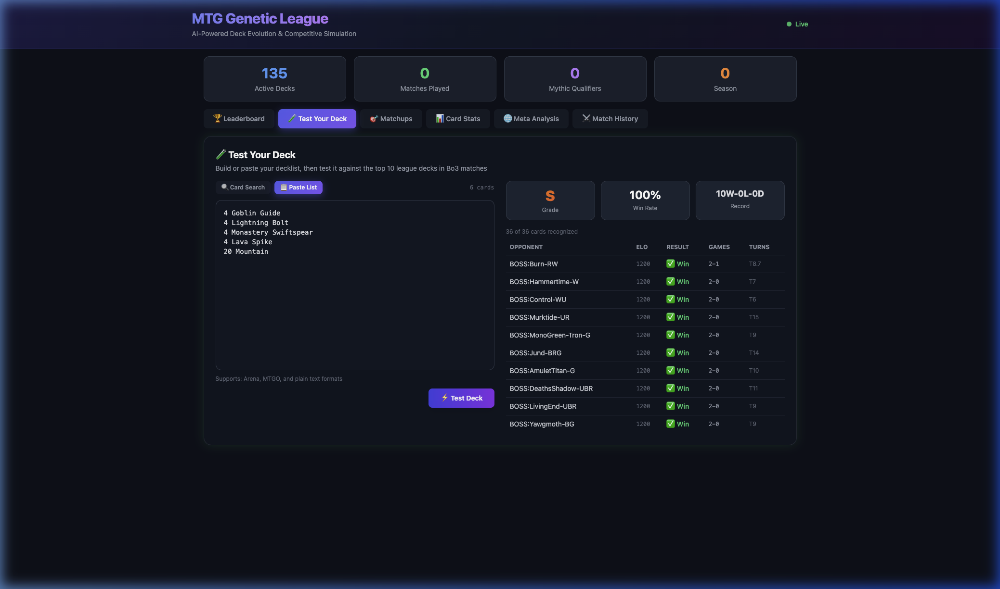
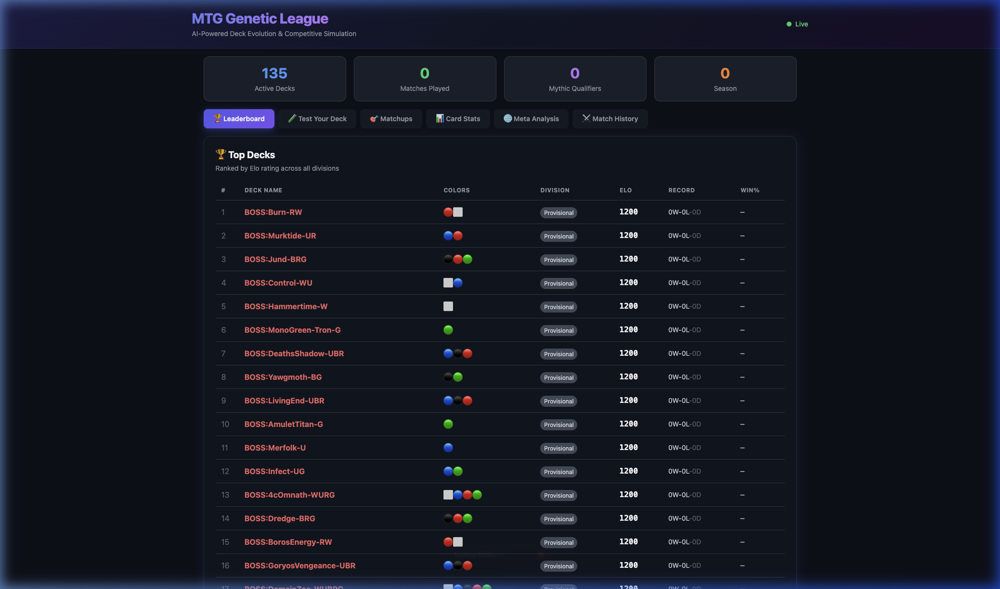
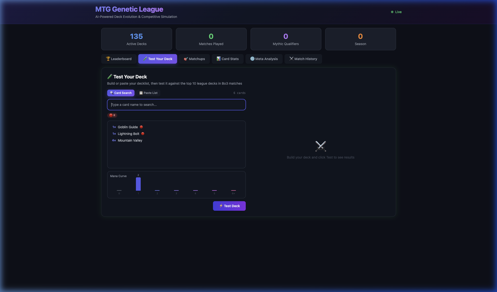

# 🧬 MTG Genetic League

**AI-Powered Deck Evolution & Competitive Simulation**

A genetic algorithm that evolves Magic: The Gathering decks through simulated competition. Decks breed, mutate, and compete in an ELO-rated league — the fittest strategies survive across generations.



## ✨ Features

- **Genetic Evolution** — Decks crossbreed winning strategies and mutate card choices across generations
- **Full Rules Engine** — Combat (first strike, deathtouch, trample, flying, menace, lifelink), stack with priority, ETB/death triggers, mana dorks, hybrid mana, planeswalkers, equipment, auras
- **Heuristic AI Agents** — Smart combat decisions, threat assessment, counter-spell logic, lethal burn detection
- **ELO Rating System** — Decks earn rankings through Bo3 matches with division tiers (Provisional → Mythic)
- **Interactive Dashboard** — Live leaderboard, deck builder with autocomplete, mana curve visualization, matchup analysis
- **Deck Tester** — Paste any decklist to test against the top league decks with instant win rate and grade

## 🏗️ Architecture

```
┌─────────────────────────────────────────────────────┐
│                    Web Dashboard                     │
│          FastAPI + Jinja2 + Tailwind CSS             │
│   Leaderboard │ Deck Builder │ Stats │ Match History │
└───────────────────────┬─────────────────────────────┘
                        │
        ┌───────────────┼───────────────┐
        ▼               ▼               ▼
  ┌───────────┐  ┌────────────┐  ┌────────────┐
  │  League    │  │ Simulation │  │   Data     │
  │  Manager   │  │  Runner    │  │  (SQLite)  │
  │  ELO+Breed │  │  Parallel  │  │  Decks,ELO │
  └─────┬─────┘  └──────┬─────┘  └────────────┘
        │               │
        ▼               ▼
  ┌───────────────────────────────┐
  │        Game Engine            │
  │  Phases │ Stack │ Priority    │
  │  Combat │ SBAs  │ Zones      │
  └─────────────┬─────────────────┘
                │
        ┌───────┼───────┐
        ▼               ▼
  ┌───────────┐  ┌───────────┐
  │ Heuristic │  │   Card    │
  │   Agent   │  │  Builder  │
  │ (AI Play) │  │  (Oracle) │
  └───────────┘  └───────────┘
```

## 🚀 Quick Start

### Prerequisites

- Python 3.10+
- ~500MB free disk space (for card data)

### Setup

```bash
# Clone the repo
git clone https://github.com/YOUR_USERNAME/mtg-genetic-league.git
cd mtg-genetic-league

# Create virtual environment
python3 -m venv .venv
source .venv/bin/activate

# Install dependencies
pip install -r requirements.txt

# Fetch card data from Scryfall (CC0 licensed)
python scripts/fetch_cards.py
python scripts/filter_legal.py

# Initialize the database with seed decks
cp data/seed_league.db data/league.db
```

### Run the League

```bash
# Start the evolution league (runs continuously, Ctrl+C to stop)
python run_league.py
```

### Start the Dashboard

```bash
# In a separate terminal
python -m uvicorn web.app:app --host 0.0.0.0 --port 8000
```

Then open [http://localhost:8000](http://localhost:8000) to see the live dashboard.

### Test a Deck

You can test any decklist against the top league decks using the "Test Your Deck" tab, or via API:

```bash
curl -X POST http://localhost:8000/api/test-deck \
  -H 'Content-Type: application/json' \
  -d '{"decklist": "4 Lightning Bolt\n4 Goblin Guide\n20 Mountain"}'
```

## 📁 Project Structure

| Directory | Purpose |
|-----------|---------|
| `engine/` | Core game engine — card model, game loop, phases, stack, zones, player |
| `agents/` | AI players — heuristic agent with threat assessment and combat logic |
| `simulation/` | Match runner, parallel execution, stats collection |
| `league/` | League manager — ELO ratings, genetic evolution, deck breeding |
| `data/` | SQLite database, card pool (generated from Scryfall) |
| `web/` | FastAPI dashboard — leaderboard, deck builder, match history |
| `scripts/` | Data pipeline — fetch cards from Scryfall, filter by format |
| `tests/` | Test suite — engine mechanics, mana payment, combat, keywords |

## 🧪 Running Tests

```bash
pytest
```

Test coverage includes:

- Mana payment with dorks and hybrid costs
- Combat mechanics (first strike, deathtouch, lifelink, trample)
- Stack resolution with priority
- ETB triggers and death triggers
- Card keyword parsing

## 🎮 How It Works

### Genetic Evolution

1. **Seed** — ~425 random decks across all 25 color combinations
2. **Compete** — Each deck plays Bo3 matches against peers, gaining/losing ELO
3. **Select** — Bottom 20% of decks are retired each season
4. **Breed** — Top decks crossbreed: combine the card pools of two winners
5. **Mutate** — Random mutations add/remove/swap cards (5% chance each)
6. **Repeat** — Over hundreds of seasons, dominant strategies emerge

### Engine Rules Coverage

| Rule Area | Implementation |
|-----------|---------------|
| Mana System | Colored/generic/hybrid costs, mana dorks, backtracking solver |
| Combat | First strike, double strike, deathtouch, lifelink, trample, flying, menace, vigilance |
| Stack | LIFO resolution, dual-pass priority, triggers (ETB, death, upkeep, landfall, combat) |
| Keywords | ~30 keywords parsed from Oracle text |
| Card Types | Creatures, instants, sorceries, enchantments, artifacts, equipment, planeswalkers, lands |
| Special | Flashback, kicker, cycling, crew, ward, hexproof, indestructible, protection |

## 📊 Screenshots

| Leaderboard | Deck Builder |
|-------------|-------------|
|  |  |

## 📝 Card Data

Card data is sourced from the [Scryfall API](https://scryfall.com/docs/api) under [CC0 license](https://creativecommons.org/publicdomain/zero/1.0/). Magic: The Gathering is a trademark of Wizards of the Coast. This project is not affiliated with or endorsed by Wizards of the Coast.

## 📄 License

[MIT](LICENSE)
