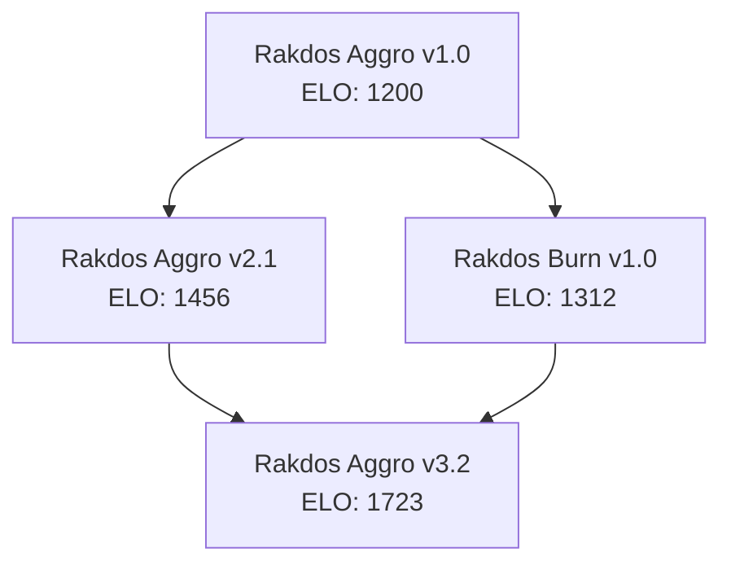
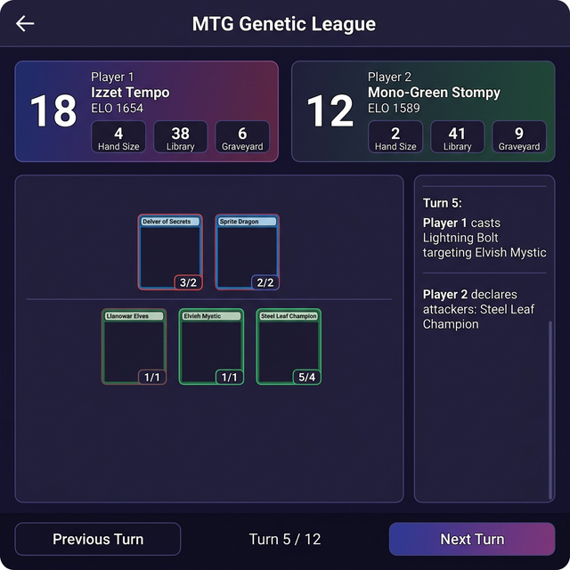

# Getting Started with MTG Genetic League

A day-0 walkthrough of every feature — from first run to understanding your evolved metagame.

---

## 1. First Run: Seeding the League

### Install and fetch cards

```bash
git clone https://github.com/mstits/MTG-Genetic-League-Deck-Testing.git
cd MTG-Genetic-League-Deck-Testing
python -m venv .venv && source .venv/bin/activate
pip install -r requirements.txt

# Fetch the full legal card pool from Scryfall (~170 MB)
python scripts/fetch_cards.py
```

### Seed tournament decks as "Boss" benchmarks

```bash
python scripts/import_tournament.py
```

This imports real tournament decklists that serve as **Boss decks** — fixed benchmarks that the genetic algorithm's evolved decks must compete against. Think of them as gym leaders.

### Run your first season

```bash
python run_league.py
```

This kicks off the evolutionary cycle:

1. Creates an initial population of ~50 decks per color
2. Pairs decks for Best-of-Three matches with sideboarding
3. Updates ELO ratings
4. Culls the bottom 5%
5. Breeds top performers and injects wild cards
6. Repeats for the configured number of seasons

You'll see output like:

```
Season 1 / 10 — 120 matches played
  Gen 1/5 | Best: 14.2
  🌟 Population converged at Gen 4 (variance: 0.118)
Season 2 / 10 — 118 matches played
...
```

### Launch the dashboard

```bash
python -m uvicorn web.app:app --reload --port 8000
```

Open **<http://localhost:8000>** in your browser.

---

## 2. Dashboard Tour

### Leaderboard


The main dashboard shows:

- **Season stats** — active decks, total matches, top ELO
- **Leaderboard** — all decks ranked by ELO with division badges (Bronze → Silver → Gold → Platinum → Mythic)
- **Top Cards** — sidebar showing which cards appear in the highest win-rate decks

**Try it:** Click any deck name to see its detail page.

### Deck Detail


Each deck has its own profile page showing:

- **Decklist** — full 60 cards organized by type (Creatures, Spells, Lands)
- **Matchup Spread** — win rate broken down by opponent archetype
- **Evolution Lineage** — a Mermaid family tree showing which parent decks this one was bred from
- **Export** — download the decklist in Arena or MTGO format (includes sideboard)

**Try it:** Click "Export to Arena" and paste into MTG Arena's deck import.

---

## 3. Testing Your Own Decks

### Test against the league

Use the deck builder on the dashboard (or the API directly) to test your own decklist:

```bash
curl -X POST http://localhost:8000/api/test-deck \
  -H "Content-Type: application/json" \
  -d '{
    "decklist": "4 Lightning Bolt\n4 Goblin Guide\n4 Monastery Swiftspear\n4 Eidolon of the Great Revel\n...",
    "num_matches": 10
  }'
```

The response shows your deck's win rate and ELO estimate against the top league opponents.

### Mulligan evaluation

Test whether an opening hand is keepable:

```bash
curl -X POST http://localhost:8000/api/mulligan-eval \
  -H "Content-Type: application/json" \
  -d '{
    "hand": ["Lightning Bolt", "Goblin Guide", "Mountain", "Mountain", "Eidolon of the Great Revel", "Monastery Swiftspear", "Searing Blaze"],
    "opponent_archetype": "Control"
  }'
```

The Mulligan AI evaluates your hand's "goldfish win turn" (how fast it can win without interaction) and adjusts based on the opponent archetype:

- vs **Burn/Combo**: needs interaction by turn 2
- vs **Control**: card quantity matters more than speed
- vs **Aggro**: needs early plays on curve

---

## 4. Watching Evolution

### Metagame Trends


Navigate to the **Meta** tab to see how the metagame shifts over seasons:

- **Archetype Popularity** — which strategies are most/least played
- **Win Rate by Archetype** — which strategies are actually winning
- **Color Distribution** — donut chart of color combination shares
- **Matchup Matrix** — heatmap showing which colors beat which

**What to look for:** If Aggro's popularity rises but its win rate drops, the meta has adapted. If a color pair has very low representation but high win rate, it might be an undiscovered gem.

### Deck Lineage

Click any deck → **"View Lineage"** to see its evolutionary family tree:



This shows how the genetic algorithm combined card pools from parent decks and which mutations led to rating improvements.

### Card Coverage

Check which cards from the pool are actually being played:

```bash
curl http://localhost:8000/api/card-coverage?limit=20
```

Returns play rates — if a powerful card has 0% usage, the genetic algorithm hasn't discovered it yet (good candidate for manual deck seeding).

---

## 5. Match Replay



Click any match from the **Matches** tab to watch a turn-by-turn replay:

- **Player panels** — life totals, hand sizes, library/graveyard counts
- **Battlefield** — creatures laid out with power/toughness
- **Game log** — every action with timestamps (cast, attack, block, resolve)
- **Turn navigation** — step through the game with Previous/Next buttons

**What to look for:** Watch how the AI makes combat decisions. Does it hold removal for the right threats? Does it deploy creatures on curve? The game log reveals the decision-making.

---

## 6. Admin Controls

Navigate to **<http://localhost:8000/admin>** for the admin portal:

### Runtime Configuration

Adjust simulation parameters without restarting:

- **Max Workers** — parallel processes for running matches
- **Memory Limit** — per-worker memory cap
- **Max Turns** — force-draw after N turns (prevents infinite loops)
- **Headless Mode** — toggle verbose logging on/off

### Restart Simulation

Click "Restart" to kick off a new evolution cycle in the background.

### Misplay Hunter (Butterfly Maps)

When a high-ELO deck loses to a low-ELO deck, the Misplay Hunter runs a Monte Carlo analysis to find the "pivot turn" — the decision that changed the game outcome. View these reports to understand where the AI's strategy breaks down.

---

## 7. API Quick Reference

| What you want | Endpoint | Method |
|--------------|----------|--------|
| See the leaderboard | `/api/leaderboard` | GET |
| Test your deck | `/api/test-deck` | POST |
| Evaluate a hand | `/api/mulligan-eval` | POST |
| Export a decklist | `/api/export/{id}` | GET |
| View meta trends | `/api/meta-trends` | GET |
| Check card usage | `/api/card-coverage` | GET |
| Matchup matrix | `/api/matchup-matrix` | GET |
| Top performing cards | `/api/top-cards` | GET |
| Stream ELO updates | `/ws/elo` | WebSocket |

---

## 8. What's Next?

Once you're comfortable with the basics:

- **Seed your own decks** — Add decklists to `scripts/import_tournament.py` and re-run
- **Tune the engine** — Edit `engine/engine_config.py` to adjust turn limits, worker count
- **Extend the AI** — Add new heuristics to `agents/heuristic_agent.py`
- **Add mechanics** — Implement new card effects via Oracle text parsing in `engine/card.py`
- **Run distributed** — Scale up with `docker-compose up -d --build` for Redis-distributed matches
